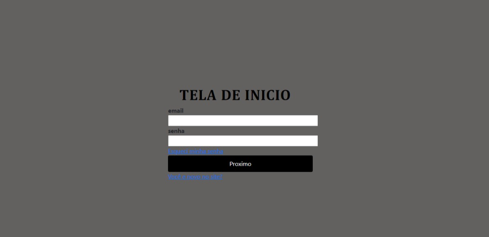
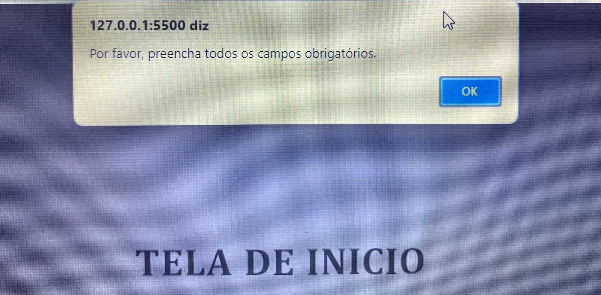

# tela de login

# sobre
Este projeto foi desenvolvido utilizando HTML, JavaScript e CSS como parte do curso de Programação Web I. Ele oferece a funcionalidade de login, permitindo que os usuários façam login com suas credenciais existentes ou criem uma nova conta, caso não possuam uma. Além disso, há a opção de redefinir a senha clicando em "Esqueci a senha".
No entanto, é importante preencher todos os campos obrigatórios. Se algum campo estiver em branco, uma mensagem será exibida solicitando que todos os campos sejam preenchidos antes de prosseguir.

# funcionalidade  
* criar ou entra em uma conta existente
* caso voce esqueca a senha tem como recriar a senha que voce esqueceu
# tecnologias utilizadas
* ✅  HTML5
* ✅  CSS3
* ✅  javascript
* ✅  Visual Studio Code 
* ✅  Git 
* ✅  GitHub
# Autores
 * pessoas que me ajudou a criar o calendario 
 
<https://github.com/mariayanagui> 
<https://github.com/LeonardoRochaMarista>  
<https://github.com/queijitos>  